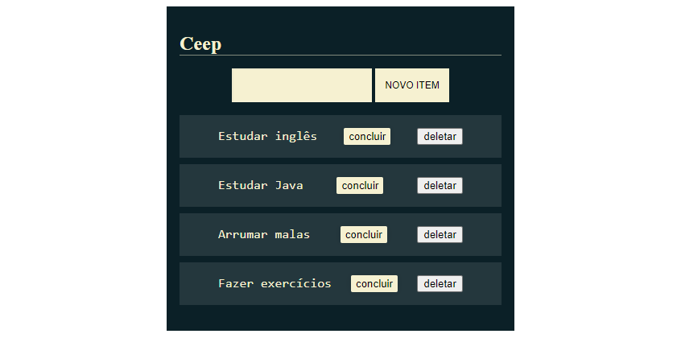

# Ceep - Lista de Tarefas

## Índice

- [1. Status do projeto](#1-status-do-projeto)
- [2. Acesso](#2-acesso)
- [3. Descrição](#3-descricao)
- [4. Tecnologias utilizadas](#4-tecnologias-utilizadas)
- [5. Pessoa desenvolvedora](#5-pessoa-desenvolvedora)

## 1. Status do projeto

-  

## 2. Acesso

O deploy do projeto foi realizado pelo Netlify. [Clique aqui](https://dainty-sfogliatella-46aee1.netlify.app/) para acessá-lo.

### Como usar
Você precisará:

- Clonar o projeto
- Iniciar a aplicação com o Live Server (extensão VS Code)
## 3. Descrição

Projeto desenvolvido durante um curso introdutório de manipulação da DOM com JavaScript da Alura.

O foco foi praticar a manipulação do DOM no Javascript, os códigos de HTML e CSS foram fornecidos pelo curso.

### Features

- Adicionar tarefas
- Marcar como concluída
- Apagar tarefa 

## 4. Tecnologias utilizadas

- Javascript
- HTML5
- CSS3
## 5. Pessoa desenvolvedora

Este projeto foi desenvolvido durante o Curso de React Para Iniciantes - 
Felipe Rocha - dicasparadevs (Youtube).

<table>
  <tr>
    <td align="center">
      <a href="https://www.linkedin.com/in/lromao/">
           
  
          <b>Lidianne Romão</b>
        
      </a>
    </td>
  </tr>
</table>